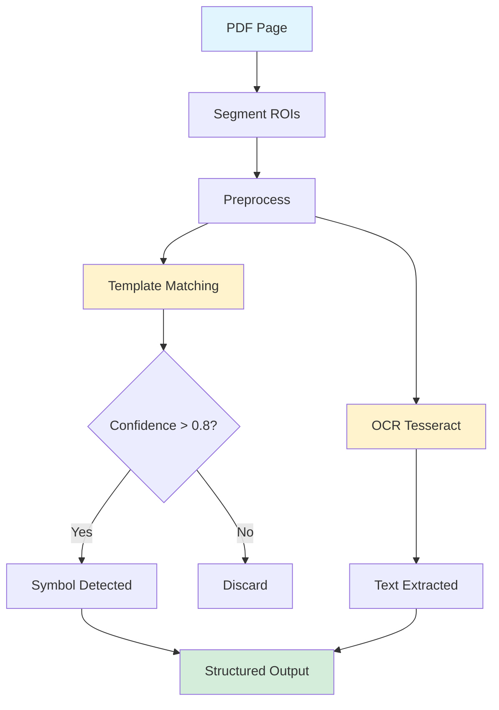

# SinceAI — Quick Overview

This repo contains a small web app (frontend) and a PDF extraction API (backend). The README below explains the two components, the API routes the frontend calls, and simple diagrams showing how they work.

## System Architecture

**Containers / Services:**

- **Frontend:** `Next.js` web app (UI for upload, analyze, and summary) - runs on port `3000`
- **Backend API:** `SinceAI PDF API` — Python FastAPI app in `python-stuff/` - runs on port `10000`

Both services are orchestrated with `docker-compose.yml` for easy deployment.

**Backend API Routes (what the frontend calls):**

- **`POST /extract`**: Upload a PDF file and receive extracted data (pages → rows with `row_index`, `symbol`, `symbol_score`, `suoja`). This is the main route used by the frontend after uploading a PDF.
- **`POST /upload`**: Upload a PDF and return a base64 PDF for direct display (frontend image preview).
- **`POST /upload/async`**: Upload a PDF for asynchronous processing (returns job id).
- **`POST /extract-with-pdf`**: Returns both the extraction JSON and the PDF as base64 in the same response.
- **`GET /`** and **`GET /health`**: Simple health/status endpoints.

**Frontend Pages / Routes (user-facing):**

- **`/`** — Home
- **`/upload`** — Upload PDF and start extraction
- **`/analyze`** — View PDF pages + extraction panels
- **`/summary`** — Aggregated summary and export

### System Communication Diagram

```mermaid
flowchart LR
    A[Browser User] --> B[Next.js Frontend]
    B -->|POST /extract| C[FastAPI Backend Docker]
    C -->|Extraction JSON| B
    B --> D[/analyze page]
    D --> E[/summary page]

    style A fill:#e1f5ff
    style C fill:#fff3cd
    style E fill:#d4edda
```

**Notes for non-technical users:**

- The frontend automatically redirects to `/analyze` after a successful upload (upload → extract → analyze).
- From the `/analyze` page you can navigate to `/summary` to see aggregated results and export options.
- Both `/analyze` and `/summary` require an uploaded PDF to work. If no PDF is present the UI will prompt you to upload one.

## AI Processing Workflow

The extraction technology is lightweight and runs on CPU-only hardware (laptops, embedded devices). It uses classical computer vision and a pretrained OCR model (Tesseract) for data extraction.

### Processing Steps

1. **Ingest document** - Load the input PDF page
2. **Segment ROIs** - Extract regions using fixed positions or line detection
3. **Preprocess** - Binarize images and remove noise
4. **Template matching** - Compare ROIs against symbol templates using OpenCV
5. **Filter by confidence** - Keep matches above 0.8-0.85 threshold
6. **OCR text extraction** - Run Tesseract on ROIs for text fields
7. **Combine data** - Merge symbols, text, and position coordinates
8. **Output** - Generate structured JSON

### AI Processing Diagram



**Core Features:**

- **CPU-only processing** - No GPU required, runs on standard hardware
- **Classical computer vision** - OpenCV template matching for symbols
- **Template-based recognition** - Pre-cut symbol templates from documents
- **Flexible architecture** - Add new symbols without retraining models
- **Dual extraction** - Symbols via template matching + text via OCR
- **Confidence filtering** - Adjustable threshold (typically 0.8-0.85)
- **Adaptive segmentation** - Handles both fixed and complex page layouts

## Local Testing & Deployment

The entire application (frontend + backend) can be started with a single command using Docker Compose.

**Start both services:**

```bash
# build and start both frontend and backend
docker-compose up --build
```

This will:

- Build and start the backend API on `http://localhost:10000`
- Build and start the frontend on `http://localhost:3000`

Open `http://localhost:3000` in your browser, go to **Upload**, choose a PDF, and click **Upload and Analyze**. The frontend will call the backend `/extract` route and show extracted rows.

**Stop all services:**

```bash
# stop and remove containers
docker-compose down
```

### Development Mode (Optional)

For frontend-only development without Docker:

```bash
# ensure backend is running (via docker-compose or manually)
npm install
npm run dev
```

## Troubleshooting

- **Services not starting:** Check `docker-compose logs` to see error messages from both services.
- **Upload failures:** Check browser console and backend logs with `docker-compose logs backend`.
- **Missing icons/values:** Check browser console for frontend errors and `docker-compose logs backend` for processing details.
- **Port conflicts:** Ensure ports `3000` and `10000` are not already in use by other applications.
- **Backend not responding:** Verify services are running with `docker-compose ps` and backend is accessible at `http://localhost:10000/health`.

## Quick Reference

**Useful Commands:**

```bash
# start everything
docker-compose up --build

# start in background (detached mode)
docker-compose up -d --build

# view logs
docker-compose logs -f

# view logs for specific service
docker-compose logs -f backend
docker-compose logs -f frontend

# stop everything
docker-compose down

# rebuild after code changes
docker-compose up --build
```

**Project Structure:**

```
SINCEAI/
├── frontend/          # Next.js application
│   └── src/
├── python-stuff/      # Backend API
│   ├── app/          # FastAPI application code
│   ├── Dockerfile    # Backend container config
│   └── requirements.txt
├── docker-compose.yml # Orchestration config
└── README.md
```

If something looks wrong, check the browser console for logs and the backend logs for details.
