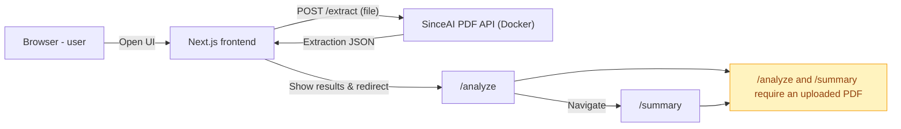

**SinceAI — Quick Overview**

This repo contains a small web app (frontend) and a PDF extraction API (backend). The README below explains the two components, the API routes the frontend calls, and a simple diagram showing how they communicate. The text is short and aimed at non-IT readers.

**Containers / Services:**

- **Frontend:** `Next.js` web app (UI for upload, analyze, and summary). Launch locally with `npm run dev` (default port `3000`).
- **Backend API (Docker):** `SinceAI PDF API` — Python FastAPI app packaged in Docker. Runs in the repository under `python-stuff/` and the Dockerfile starts the API on port `10000` inside the container.

**Backend API Routes (what the frontend calls):**

- **`POST /extract`**: Upload a PDF file and receive extracted data (pages → rows with `row_index`, `symbol`, `symbol_score`, `suoja`). This is the main route used by the frontend after uploading a PDF.
- **`POST /upload`**: Upload a PDF and return a base64 PDF for direct display (frontend image preview).
- **`POST /upload/async`**: Upload a PDF for asynchronous processing (returns job id).
- **`POST /extract-with-pdf`**: Returns both the extraction JSON and the PDF as base64 in the same response.
- **`GET /`** and **`GET /health`**: Simple health/status endpoints.

**Frontend Pages / Routes (user-facing):**

- **`/`** — Home
- **`/upload`** — Upload PDF and start extraction
- **`/analyze`** — View PDF pages + extraction panels
- **`/summary`** — Aggregated summary and export

**Simple Communication Diagram (Mermaid)**



Notes for non-technical users:

- The frontend automatically redirects to `/analyze` after a successful upload (upload → extract → analyze).
- From the `/analyze` page you can navigate to `/summary` to see aggregated results and export options.
- Both `/analyze` and `/summary` require an uploaded PDF to work. If no PDF is present the UI will prompt you to upload one.

- To test locally, start the backend container (see `python-stuff/Dockerfile`) and ensure the API is reachable at `http://localhost:10000`.
- Then run the frontend: open a terminal in the repo root and run:

```bash
# start frontend (dev mode)
npm install
npm run dev
```

Open `http://localhost:3000` in your browser, go to **Upload**, choose a PDF, and click **Upload and Analyze**. The frontend will call the backend `/extract` route and show extracted rows.

If something looks wrong (missing icons or values), check the browser console for logs and the backend logs for details.

**Quick Docker commands (backend)**

```bash
# build the backend image (from repo root)
docker build -t sinceai-python ./python-stuff

# run the backend container and map port 10000
docker run --rm -p 10000:10000 sinceai-python
```

**Troubleshooting (quick)**

- If Next dev reports a lock (".next/dev/lock"), stop the running `next dev` process or remove `.next` and restart the frontend.
- If uploads fail, check browser console and backend logs (container stdout). Ensure `NEXT_PUBLIC_API_URL` points to the running backend (e.g., `http://localhost:10000`).

That's it — short and simple. If you'd like, I can add a one-line troubleshooting checklist or a diagram image file next.
